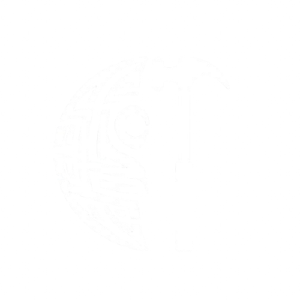

# ForgeDefender

<p align="center">
  
</p>

A Visual Studio Code extension that brings the power of test exploration to Foundry smart contract projects. View, run, and analyze your Solidity tests with a beautiful visual interface showing gas usage, execution status, and detailed error information. 

## Features

### 🎯 Visual Test Explorer
- **Tree View Interface**: Browse tests organized by contract
- **Real-time Status**: See test status with color-coded icons (✅ passed, ❌ failed, ⏳ running, ⚪ pending)
- **Gas Usage Tracking**: Monitor gas consumption for each test execution
- **Execution Time**: Track how long each test takes to run

### ⚡ Test Execution
- **Run All Tests**: Execute your entire test suite with one click
- **Individual Test Runs**: Run specific tests directly from the explorer
- **Real-time Updates**: Watch test status change as they execute
- **Detailed Output**: Comprehensive test results in the output channel

### 📊 Rich Information Display
- **Gas Metrics**: See exact gas usage for optimization insights
- **Error Details**: View detailed error messages and stack traces
- **Duration Tracking**: Monitor test performance over time
- **Tooltips**: Hover for quick test information

### 🔧 Smart Integration
- **Auto-discovery**: Automatically finds and parses Foundry test files
- **File Watching**: Refreshes tests when Solidity files change
- **Project Detection**: Only activates in Foundry projects (foundry.toml/forge.toml)
- **JSON Parsing**: Processes Foundry's JSON output for accurate results

## Installation

### From Source
1. Clone this repository
2. Run `npm install` to install dependencies
3. Run `npm run compile` to build the extension
4. Press `F5` to launch a new VS Code window with the extension loaded

### Building VSIX Package
```bash
npm install -g vsce
vsce package
code --install-extension forgedefender-<version>.vsix
```

## Usage

### Prerequisites
- [Foundry](https://getfoundry.sh/) installed and accessible via `forge` command
- A Foundry project with `foundry.toml` or `forge.toml` configuration file
- Solidity test files in the `test/` directory following Foundry conventions

### Getting Started

1. **Open a Foundry Project**: Open a folder containing a Foundry project in VS Code
2. **Locate the Test Explorer**: Find the ForgeDefender icon in the Activity Bar (left sidebar)
3. **Configure Test Directories** (optional): The extension will automatically find tests in `test/` and `tests/` directories, but you can customize this
4. **Run Tests**: Click the play button to run all tests or individual test items

### Pre-Test Setup

The extension automatically handles project setup before running tests:

- **📦 NPM Install**: Runs `npm install` if `package.json` exists (configurable)
- **🔨 Forge Build**: Runs `forge build` to ensure project compiles (configurable)
- **📁 Smart Discovery**: Only scans configured test directories, excluding dependencies

### Excluding Dependencies

The extension is smart about excluding dependency tests by default. It excludes:
- `node_modules/`
- `lib/` (Foundry dependencies)
- `deps/` and `dependencies/`

You can customize this behavior in your project's `.vscode/settings.json`:

```json
{
  "forgeDefender.testDirectories": ["test", "tests", "src/test"],
  "forgeDefender.excludePatterns": [
    "**/node_modules/**",
    "**/lib/**",
    "**/forge-std/**",
    "**/openzeppelin-contracts/**"
  ]
}
```

### Test File Structure
Your test files should follow standard Foundry patterns:

```solidity
// SPDX-License-Identifier: MIT
pragma solidity ^0.8.19;

import "forge-std/Test.sol";
import "../src/MyContract.sol";

contract MyContractTest is Test {
    MyContract public myContract;

    function setUp() public {
        myContract = new MyContract();
    }

    function testSomething() public {
        // Your test logic here
        assertTrue(myContract.someFunction());
    }

    function testFailsWhenExpected() public {
        // Test that should fail
        vm.expectRevert();
        myContract.someFailingFunction();
    }
}
```

### Commands

| Command | Description | Shortcut |
|---------|-------------|----------|
| `forgeDefender.runAllTests` | Run all discovered tests | Click ▶️ in panel title |
| `forgeDefender.runTest` | Run a specific test | Click ▶️ next to test |
| `forgeDefender.refreshTests` | Refresh test discovery | Click 🔄 in panel title |
| `forgeDefender.showTestOutput` | Show detailed test output | Click 📄 next to test |

## Configuration

The extension provides several configuration options that can be set in your VS Code settings or project-specific `.vscode/settings.json`:

```json
{
  "forgeDefender.testDirectories": ["test", "tests"],
  "forgeDefender.excludePatterns": [
    "**/node_modules/**", 
    "**/lib/**", 
    "**/deps/**", 
    "**/dependencies/**"
  ],
  "forgeDefender.runBuildBeforeTests": true,
  "forgeDefender.runNpmInstallBeforeTests": true,
  "forgeDefender.autoRun": false,
  "forgeDefender.showGasUsage": true,  
  "forgeDefender.verboseOutput": false
}
```

### Configuration Options

- **testDirectories**: Array of directories to scan for test files (relative to workspace root)
- **excludePatterns**: Glob patterns to exclude when scanning (great for excluding dependencies)
- **runBuildBeforeTests**: Run `forge build` before executing tests
- **runNpmInstallBeforeTests**: Run `npm install` before tests (if package.json exists)
- **autoRun**: Automatically run tests when files change
- **showGasUsage**: Display gas usage in test descriptions  
- **verboseOutput**: Show verbose test output in the channel

## Visual Interface

### Test Status Icons
- ✅ **Green Check**: Test passed successfully
- ❌ **Red X**: Test failed with errors
- ⏳ **Spinning Circle**: Test currently running
- ⚪ **Empty Circle**: Test pending execution

### Test Information Display
- **Gas Usage**: ⛽ Shows gas consumed (e.g., "⛽ 21,000")
- **Duration**: ⏱️ Shows execution time (e.g., "⏱️ 150ms")
- **Error Details**: Full error messages in tooltips and output

### Tree Structure
```
🧪 ForgeDefender (Activity Bar)
├── 📄 MyContractTest
│   ├── ✅ testBasicFunctionality ⛽ 45,231 ⏱️ 12ms
│   ├── ❌ testEdgeCase ⛽ 23,891 ⏱️ 8ms
│   └── ⚪ testPendingFeature
└── 📄 AnotherContractTest
    └── ✅ testSomethingElse ⛽ 67,123 ⏱️ 25ms
```

## Troubleshooting

### Extension Not Activating
- Ensure you have a `foundry.toml` or `forge.toml` file in your project root
- Check that you've opened the correct folder containing your Foundry project

### Tests Not Discovered  
- Verify test files are in the `test/` directory
- Ensure test functions start with `test` (e.g., `testMyFunction`)
- Check that contracts inherit from `forge-std/Test.sol`

### Forge Command Not Found
- Install Foundry: `curl -L https://foundry.paradigm.xyz | bash && foundryup`
- Ensure `forge` is in your system PATH
- Restart VS Code after installing Foundry

### Test Results Not Parsing
- Update to the latest version of Foundry
- Check the Output Channel for detailed error messages
- Ensure your project compiles successfully with `forge build`

## Development

### Project Structure
```
forge-defender/
├── package.json          # Extension manifest
├── src/
│   └── extension.ts      # Main extension code
├── tsconfig.json         # TypeScript configuration
└── README.md            # This file
```

### Building from Source
```bash
git clone <repository-url>
cd forge-defender
npm install
npm run compile
```

### Contributing
1. Fork the repository
2. Create a feature branch
3. Make your changes
4. Add tests if applicable  
5. Submit a pull request

## License

MIT License - see LICENSE file for details

---

**Made with ❤️ for the Web3 development community by Chain Defenders**
